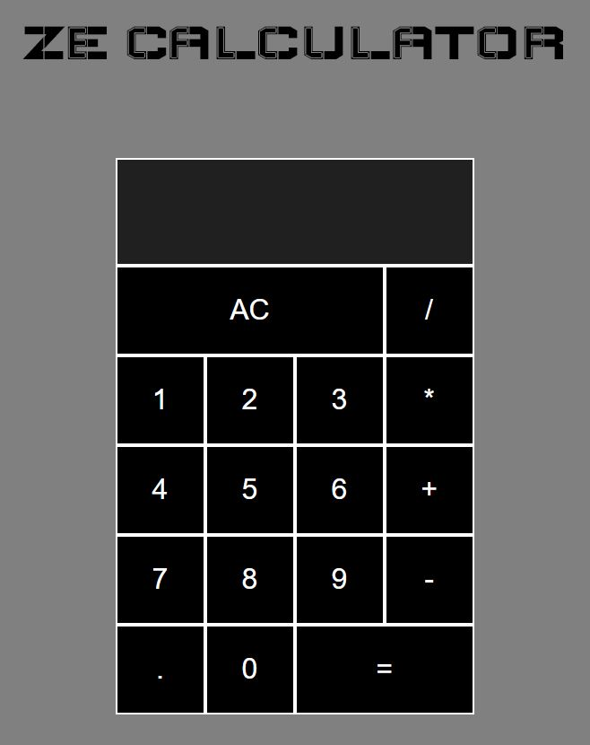

# ZE CALCULATOR Project :computer:

- Contributor
   * Ayoube El Yazizi [Github](https://github.com/ayoubelyazizi)
- Duration: 3 days
- *16/11/2020* au *18/11/2020*
  

## - **Project details :** 
### Create a calculator without typing any html but only using JavaScript to do this.

## - **Objective :** 
Make a calculator that works fine.
## - **How i proceed :** 
I created an html file that i linked with a javascript file and then i've never touched the html again. After doing this i created all my page with js that i used to do all my html div and the calculator whit all its buttons and events ecc..

## Language 

- HTML 5
- CSS 3
- JAVASCRIPT

## Extra 

- Enter to show the result
- One click on "AC" to clear the current operation
- Double click on "AC" to clear it all
- Historic of all the operations that you did

## Preview

## Github Pages Link
[Pages](https://ayoubelyazizi.github.io/ze-calculator/)